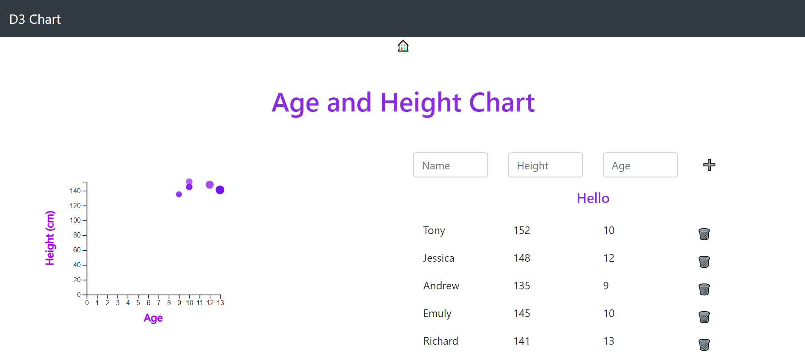

This project was bootstrapped with [Create React App](https://github.com/facebook/create-react-app).

## D3 dynamic Chart

Simple dynamic chart in d3(Data-Driven Documents)

### `npm start`

Runs the app in the development mode. 
Open [http://localhost:3000](http://localhost:3000) to view it in the browser.

#### Licence
MIT